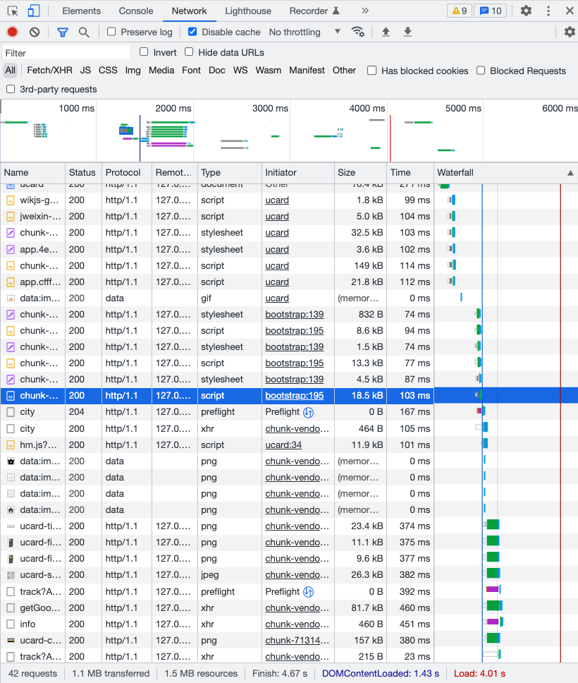
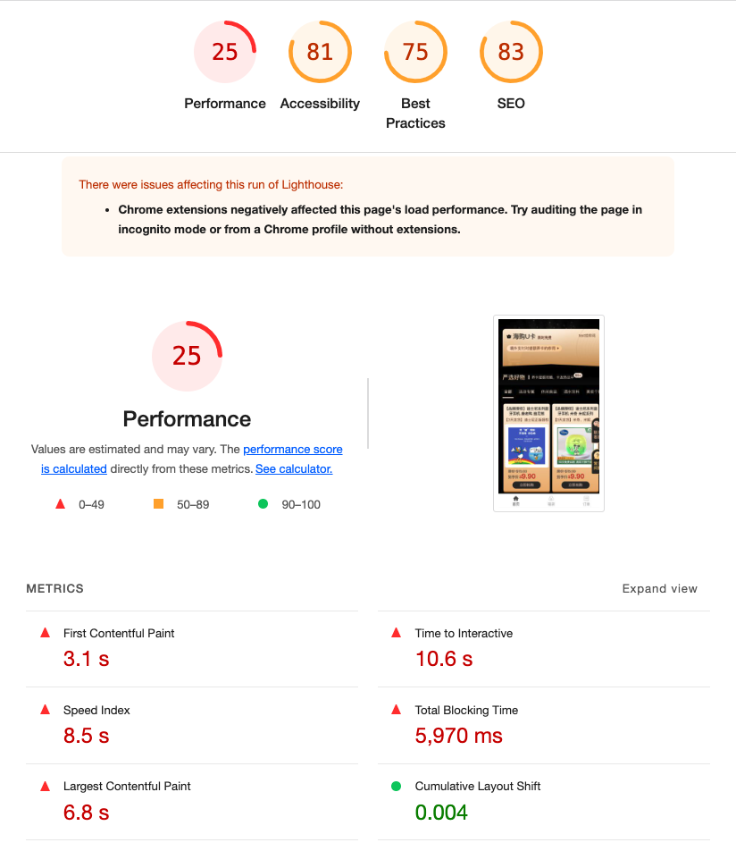

> 来自Google的数据表明，一个有10条数据0.4秒能加载完的页面，变成30条数据0.9秒加载完之后，流量和广告收入下降90%。  
> Google Map 首页文件大小从100KB减小到70-80KB后，流量在第一周涨了10%，接下来的三周涨了25%。  
> 亚马逊的数据表明：加载时间增加100毫秒，销量就下降1%。

## 背景

用户反馈，页面打开很慢

### 问题分析及解决办法

1. 用户反馈而不是自反馈 -> 引入 [前端性能异常监控](../engineering/sentry)  
2. 页面打开很慢 -> 页面性能优化

## 优化结果对比

优化前




## 关于性能优化

性能优化的最终目的是提升用户体验  
让用户觉得网页很快，包含两种，一种是真的快，一种是觉得快  
真的快：可以客观衡量的指标，例如FCP、LCP、TTI、CLS等  
觉得快：用户主观感知，通过视觉引导等手段转移用户对白屏等待时间的关注  

### 性能优化的目标

根据场景和项目复杂度不同，定制目标不同，比如  

- 比竞品快20%
- ‘2-5-10’原则
- 比优化前快20%
- 正常网速，1.5s内onload

我们的目标是：**正常网速，1.5s内onload**

### 优化指标

- [Chrome Web 指标](https://web.dev/vitals/#core-web-vitals)
- [定义核心 Web 指标阈值](https://web.dev/defining-core-web-vitals-thresholds/)

### 检测分析工具

- Chrome Network
- Chrome lighthouse
- [webpack-bundle-analyzer](https://www.npmjs.com/package/webpack-bundle-analyzer)

## Let's go

### 优化体积

> 优化前 All Chunks 1.52MB

1. 组件按需加载

2. 第三方库按需引用

3. 使用webp

    由于项目内图片使用不多，未使用

4. babel 兼容条件

### 网络传输优化

1. 开启http2

    > 通常浏览器在传输是并发请求数是有限制的(chrome 6个)，超过限制的请求需要排队

    以往我们通过域名分片、资源合并来避开这一限制

    HTTP2协议后，其可以在一个TCP链接分帧处理多个请求（多路复用）,其余特性也有性能提升

2. 优化分包策略

    > vue-cli3的默认优化是将所有npm依赖都打进chunk-vendor，但这种做法在依赖多的情况下导致chunk-vendor过大

    ```js
    config.optimization.splitChunks({
            chunks: "all",
            cacheGroups: {
            libs: {
                name: "chunk-libs",
                test: /[\\/]node_modules[\\/]/,
                priority: 10,
                chunks: "initial" // only package third parties that are initially dependent
            },
            vue: {
                name: "chunk-vue", // split vue into a single package
                priority: 20, // the weight needs to be larger than libs and app or it will be packaged into libs or app
                test: /[\\/]node_modules[\\/]_?(._)(vue|pinia)(._)/ // in order to adapt to cnpm
            },
            vantUI: {
                name: "chunk-vant", // split vantUI into a single package
                priority: 20, // the weight needs to be larger than libs and app or it will be packaged into libs or app
                test: /[\\/]node_modules[\\/]_?vant(.*)/ // in order to adapt to cnpm
            },
            commons: {
                name: "chunk-commons",
                test: resolve("src/composables"), // can customize your rules
                minChunks: 3, //  minimum common number
                priority: 5,
                reuseExistingChunk: true
            }
            }
        });

    ```

3. Gzip压缩传输和图片打包压缩

4. [预加载预请求](./performance.md#preload和prefetch)

    > `<link>`标签的rel属性的两个可选值。  
    > `Preload`，预加载，表示用户十分可能需要在当前浏览中加载目标资源，所以浏览器必须预先获取和缓存对应资源。  
    > `Prefetch`，预请求，是为了提示浏览器，用户未来可能需要目标资源，所以浏览器可能拖过事先获取和缓存对应资源来优化用户体验。

5. [OSS+CDN](./performance.md)
   1. 对象存储OSS（Object Storage Service）是阿里云提供的海量、安全、低成本、高持久的云存储服务。
   2. 阿里云内容分发网络（Content Delivery Network，简称CDN）是建立并覆盖在承载网之上，由分布在不同区域的边缘节点服务器群组成的分布式网络。

### SSR

优化方向，未采用

### 体验优化

1. 预渲染  
    预渲染：是一种使用爬虫技术的方案。使用一些技术（puppeteer）可以爬取到项目在chrome浏览器展示的页面，然后把它写入到js，和打包文件一起。
    方案：[prerender-spa-plugin](https://github.com/chrisvfritz/prerender-spa-plugin)  
    缺点：不过这种技术的缺点也很明显，我们在打包过程中，所展示的页面是当时环境下的数据，也就是说如果首页有很多的动态获取的数据，那如果采用这种方案，用户第一眼看到并不是当时数据，会认为是个错误信息

2. 骨架屏

3. 渐进加载图片

### 构建优化？

### 缓存优化？

## 知识拓展

- [ ] 可客观衡量的性能指标
- [ ] [2-5-10 原则](https://www.jianshu.com/p/f2db86f6df66)
- [ ] 使用webp方案
- [ ] http2详细
- [x] gzip拓展
  - [前端打包gzip + nginx开启静态gzip](https://www.jianshu.com/p/06b44ba366ab)
  - [HTTP协议详解——压缩问题](https://www.pianshen.com/article/76581281610/)
  - [Vue CLI 2&3 下的项目优化实践 —— CDN + Gzip + Prerender](https://juejin.cn/post/6844903687580549128)
- [x] 预渲染
  - [服务器端渲染 vs 预渲染 (SSR vs Prerendering)](https://v2.ssr.vuejs.org/zh/#%E6%9C%8D%E5%8A%A1%E5%99%A8%E7%AB%AF%E6%B8%B2%E6%9F%93-vs-%E9%A2%84%E6%B8%B2%E6%9F%93-ssr-vs-prerendering)
  - [前端prerender-spa-plugin预渲染](https://segmentfault.com/a/1190000018182165)
  - [[prerender-spa-plugin]--微型Vue项目的SEO利器](https://www.cnblogs.com/wl-blog/p/16464341.html)
  - [Vue 单页面应用如何做预渲染](https://juejin.cn/post/7022805238843179015)
